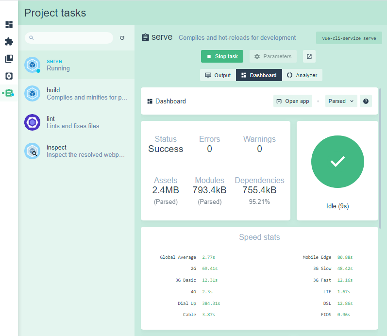
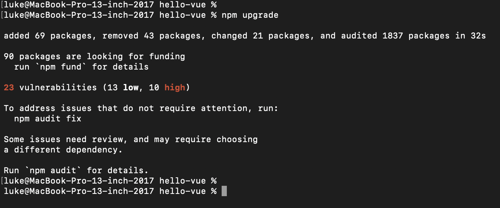

# 開發環境設定

## Windows

chocolatey + nodejs

[https://chocolatey.org/install](https://chocolatey.org/install)

[https://lukechi1219.gitbook.io/public/install/windows/chocolatey+nodejs](https://lukechi1219.gitbook.io/public/install/windows/chocolatey+nodejs)

## MacOS

安裝 nvm + nodejs

[https://lukechi1219.gitbook.io/public/install/macos/nvm+nodejs](https://lukechi1219.gitbook.io/public/install/macos/nvm+nodejs)

## 安裝 VS Code <a id="install-vs-code"></a>

[https://code.visualstudio.com/download](https://code.visualstudio.com/download)

Windows: VS Code 使用 ng 命令时提示无法加载文件: 因為這個系統上已停用指令碼執行，所以無法載入

```text
set-ExecutionPolicy RemoteSigned
```

VS Code 的中文 \(繁體\) 語言套件  
[https://marketplace.visualstudio.com/items?itemName=MS-CEINTL.vscode-language-pack-zh-hant](https://marketplace.visualstudio.com/items?itemName=MS-CEINTL.vscode-language-pack-zh-hant)

[https://marketplace.visualstudio.com/items?itemName=k--kato.intellij-idea-keybindings](https://marketplace.visualstudio.com/items?itemName=k--kato.intellij-idea-keybindings)

[https://marketplace.visualstudio.com/items?itemName=Angular.ng-template](https://marketplace.visualstudio.com/items?itemName=Angular.ng-template)

[https://marketplace.visualstudio.com/items?itemName=nrwl.angular-console](https://marketplace.visualstudio.com/items?itemName=nrwl.angular-console)

[https://marketplace.visualstudio.com/items?itemName=octref.vetur](https://marketplace.visualstudio.com/items?itemName=octref.vetur)

```text
https://vuejs.github.io/vetur/guide/setup.html

https://github.com/octref/veturpack
```

[https://marketplace.visualstudio.com/items?itemName=chenxsan.vscode-standardjs](https://marketplace.visualstudio.com/items?itemName=chenxsan.vscode-standardjs)

[https://marketplace.visualstudio.com/items?itemName=rbbit.typescript-hero](https://marketplace.visualstudio.com/items?itemName=rbbit.typescript-hero)

[https://marketplace.visualstudio.com/items?itemName=hollowtree.vue-snippets](https://marketplace.visualstudio.com/items?itemName=hollowtree.vue-snippets)

.

[https://marketplace.visualstudio.com/items?itemName=CoenraadS.bracket-pair-colorizer-2](https://marketplace.visualstudio.com/items?itemName=CoenraadS.bracket-pair-colorizer-2)

[https://marketplace.visualstudio.com/items?itemName=TabNine.tabnine-vscode](https://marketplace.visualstudio.com/items?itemName=TabNine.tabnine-vscode)

[https://marketplace.visualstudio.com/items?itemName=formulahendry.auto-close-tag](https://marketplace.visualstudio.com/items?itemName=formulahendry.auto-close-tag)

[https://marketplace.visualstudio.com/items?itemName=formulahendry.auto-rename-tag](https://marketplace.visualstudio.com/items?itemName=formulahendry.auto-rename-tag)

[https://marketplace.visualstudio.com/items?itemName=alexdima.copy-relative-path](https://marketplace.visualstudio.com/items?itemName=alexdima.copy-relative-path)

.

[https://marketplace.visualstudio.com/items?itemName=aaron-bond.better-comments](https://marketplace.visualstudio.com/items?itemName=aaron-bond.better-comments)

[https://marketplace.visualstudio.com/items?itemName=streetsidesoftware.code-spell-checker](https://marketplace.visualstudio.com/items?itemName=streetsidesoftware.code-spell-checker)

.

[https://chrome.google.com/webstore/detail/vuejs-devtools/nhdogjmejiglipccpnnnanhbledajbpd?hl=zh-TW](https://chrome.google.com/webstore/detail/vuejs-devtools/nhdogjmejiglipccpnnnanhbledajbpd?hl=zh-TW)

[https://blog.zuiyu1818.cn/posts/VScode\_Vue.html](https://blog.zuiyu1818.cn/posts/VScode_Vue.html)

Jest Runner  
[https://marketplace.visualstudio.com/items?itemName=firsttris.vscode-jest-runner](https://marketplace.visualstudio.com/items?itemName=firsttris.vscode-jest-runner)

.

## CLI 是什麼? <a id="what-is-cli"></a>


命令列介面（Command-line interface，CLI）

可用於初始化、開發、建構和維護 前端應用


### = 安裝 Angular cli = <a id="install-angular-cli"></a>

```text
npm install -g @angular/cli

ng --version
```

[http://angular.tw/cli](http://angular.tw/cli)

```text
ng new hello-angular --interactive -v
```


啟動 Angular server

```bash
cd hello-angular
ng serve --open
```

先不要關掉上面這個 Terminal , 另外開一個 Terminal

產生一個新的 Component

```bash
cd hello-angular/src/app

mkdir components
cd components

ng generate component hello-world

CREATE src/app/components/hello-world/hello-world.component.html (26 bytes)
CREATE src/app/components/hello-world/hello-world.component.spec.ts (655 bytes)
CREATE src/app/components/hello-world/hello-world.component.ts (295 bytes)
CREATE src/app/components/hello-world/hello-world.component.scss (0 bytes)
UPDATE src/app/app.module.ts (623 bytes)
```

```bash
cd hello-angular\src\app
vim app.component.html
到 355 行

	<app-hello-world></app-hello-world>
```

打開 VS Code , 打開 /hello-angular 這個資料夾

編輯 src\app\components\hello-world\hello-world.component.html 這個檔案

```bash

```

### = 安裝 Vue cli = <a id="install-vue-cli"></a>

```text
npm install -g @vue/cli

vue --version
```

[https://cli.vuejs.org/zh/guide/installation.html](https://cli.vuejs.org/zh/guide/installation.html)  
.  
[https://book.vue.tw/preface.html\#%E6%9C%AC%E6%9B%B8%E4%BD%BF%E7%94%A8%E7%9A%84%E7%89%88%E6%9C%AC](https://book.vue.tw/preface.html#%E6%9C%AC%E6%9B%B8%E4%BD%BF%E7%94%A8%E7%9A%84%E7%89%88%E6%9C%AC)

* 使用 Vue CLI 建立 project 時，建議選擇 `ESLint + Prettier` 
* Vue 3.0 底層核心由 TypeScript 所改寫，但是仍可以使用 JavaScript 來進行開發
  * Luke 建議新學的話 , 直接用 TypeScript 比較好 , 
    * 因為官方未來一定是會改版主打 TS , 現在學 JS 寫法 , 未來要重學
    * TS 更嚴謹 , 寫出的 code 比較一致 \( 對團隊角度來看較好 \)
    * TS 可以提前檢查出問題 , 開發工具更容易分析程式
  * [https://v3.cn.vuejs.org/guide/typescript-support.html](https://v3.cn.vuejs.org/guide/typescript-support.html)

```text
vue ui
```


啟動 Vue server



~~因為 Vue cli 沒有提供 "自動產生 Component" 的命令 , 所以要自己安裝外掛~~

~~因為有安全性的問題 , 所以不建議裝這個外掛....~~

[https://www.npmjs.com/package/vue-generate-component-typescript](https://www.npmjs.com/package/vue-generate-component-typescript)

```bash
cd hello-vue
npm install --save-dev vue-generate-component-typescript
```



產生一個新的 Component

```bash
npx vgc --help

cd src/components
npx vgc hello-world
```

in About.vue

```bash
...
<HelloWorldComponent></HelloWorldComponent>
...

<script lang="ts">
import { Component, Vue } from "vue-property-decorator";
import HelloWorldComponent from "@/components/hello-world/hello-world.component.vue"; // @ is an alias to /src

@Component({
  components: {
    HelloWorldComponent,
  },
})
export default class About extends Vue {}
</script>
```

不能自動產生 Component , 就只好存一份樣板

```typescript
<template>
  <div class="test">test</div>
</template>

<script lang="ts">
import { Component, Vue } from "vue-property-decorator";

@Component({})
export default class Test extends Vue {}
</script>

<style scoped lang="scss">
.test {
  color: green;
}
</style>
```

.

[https://segmentfault.com/a/1190000019055976](https://segmentfault.com/a/1190000019055976)

[https://green0221.blogspot.com/2019/02/vs-code-vue.html](https://green0221.blogspot.com/2019/02/vs-code-vue.html)


### = install Vue cli for windows =

因為 node-sass \(scss\) 會用到 python , 但是 windows 沒有 , 所以 Vue cli 建立專案會失敗

需要執行下面指令

參考 [https://danielwertheim.se/solution-to-issues-with-node-gyp-node-sass-on-windows/](https://danielwertheim.se/solution-to-issues-with-node-gyp-node-sass-on-windows/)

```bash
// I have NOT installed the windows-build-tools package as many suggests.

choco install python2

where python

npm install -g node-gyp

npm config set python "C:\Python27\python.exe"
npm config set msvs_version 2017
```

~~用 系統管理員身分執行 PowerShell , 切記會 下載非常久所以要有耐心~~

```bash
npm install --global --production windows-build-tools

npm install -g node-gyp
```

### = Nx Cli =

```text
npm install -g nx

npx create-nx-workspace@latest --cli=nx --interactive=true

npx create-nx-workspace@latest --cli=angular --interactive=true
```

[https://offering.solutions/blog/articles/2021/01/27/starting-angular-projects-with-nx/](https://offering.solutions/blog/articles/2021/01/27/starting-angular-projects-with-nx/)

[https://docs.google.com/presentation/d/1xf8aPIvQjgjUVGH\_1sRkikvh5H73x2xvX7PnN4AjYt4/edit?usp=sharing](https://docs.google.com/presentation/d/1xf8aPIvQjgjUVGH_1sRkikvh5H73x2xvX7PnN4AjYt4/edit?usp=sharing)

[https://github.com/duncanhunter/Enterprise-Angular-Applications-With-NgRx-and-Nx-Book](https://github.com/duncanhunter/Enterprise-Angular-Applications-With-NgRx-and-Nx-Book)

### = Angular Multi-Project =

```bash
# ng new my-workspace --createApplication="false"

ng new neutec --createApplication=false --strict --routing --interactive --verbose

cd neutec

ng generate application root --strict --routing --interactive
```

.

## VS Code setting.json

vscode的setting.json檔案（儲存格式化，遵循ESlint規範）

.

```bash
{
	"files.autoSaveDelay": 1000,
	"files.autoSave": "afterDelay",
	"editor.tabSize": 2,
	"explorer.compactFolders": false,

	//格式化外掛配置
	"editor.formatOnSave": true,
	//  #使用單引號替代雙引號
	"prettier.singleQuote": true,
	"prettier.tabWidth": 4,
	//  #讓函式(名)和後面的括號之間加個空格
	"javascript.format.insertSpaceBeforeFunctionParenthesis": false,

	"prettier.useTabs": true,
	"explorer.confirmDelete": true,
	"diffEditor.ignoreTrimWhitespace": true,

	"[javascript]": {
		"editor.defaultFormatter": "esbenp.prettier-vscode"
	},
	"[json]": {
		"editor.defaultFormatter": "esbenp.prettier-vscode"
	},
	"[vue]": {
		"editor.defaultFormatter": "octref.vetur"
	}
}
```

.

