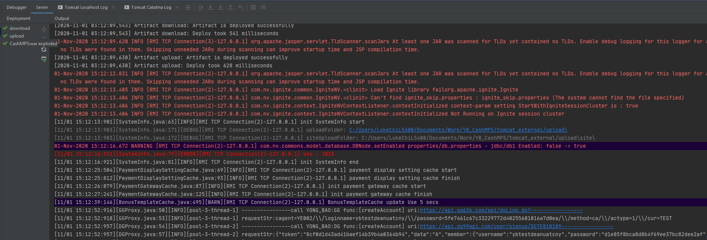
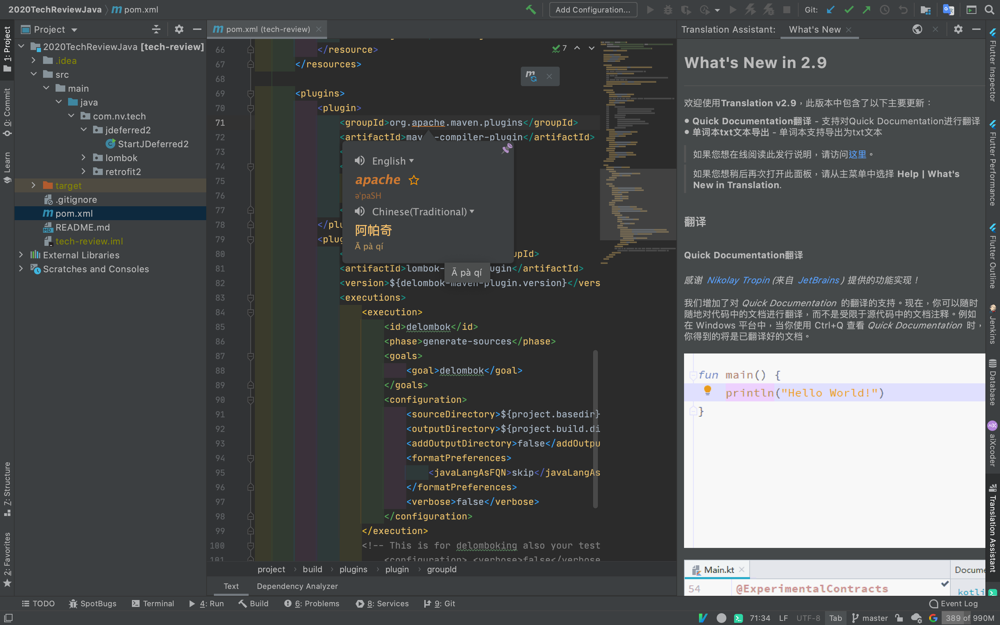
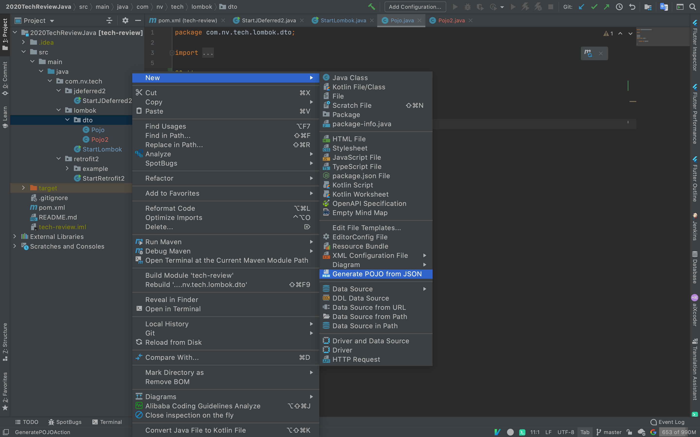
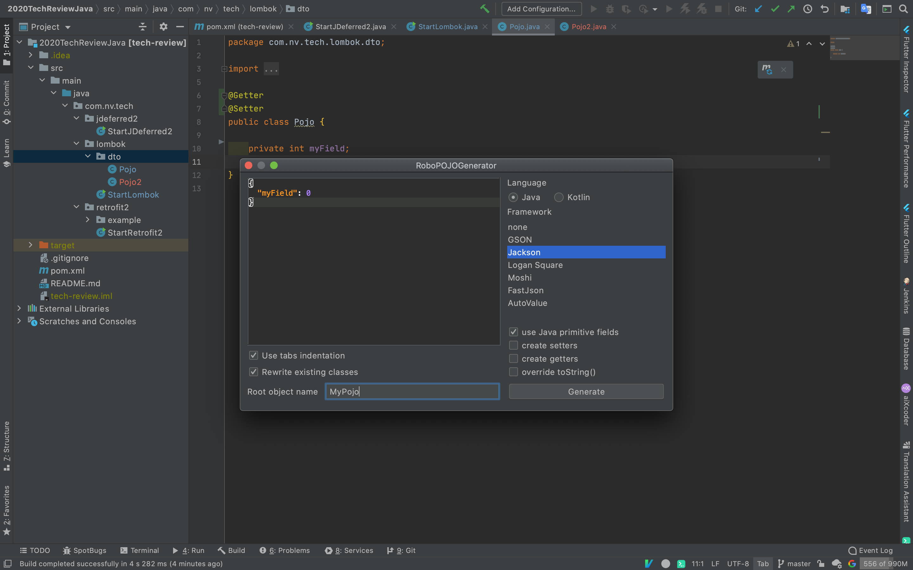
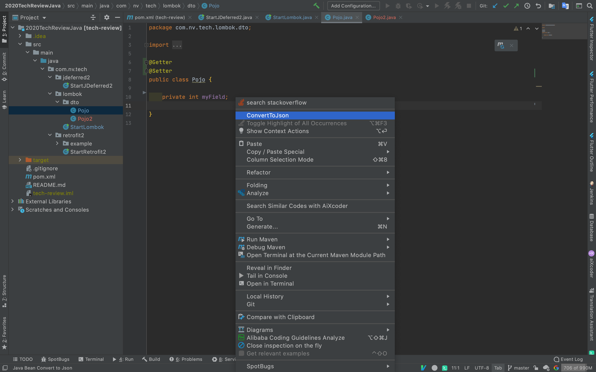
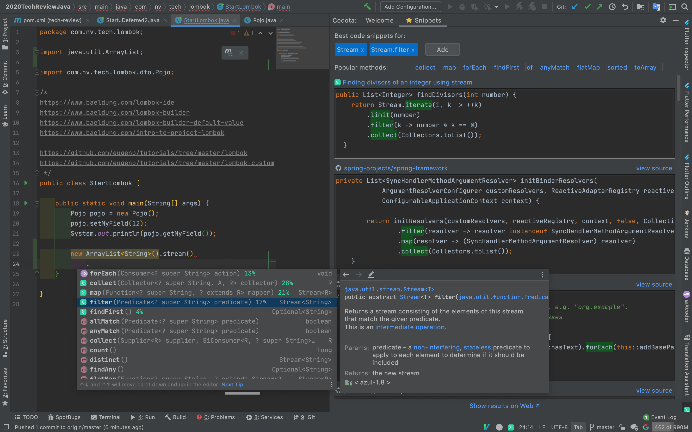

# IDEA plugins

## IDE UI

### CodeGlance



### Grep Console



### Indent Rainbow

MEMO: 如果開很大的檔案 , 似乎會影響一點 IDEA 的效能



### Rainbow Brackets



### Rainbow CSV



### Power Mode II



## Learning IDEA

### Key Promoter X

快捷键提醒 , 可以提高开发效率



### IDE Features Trainer



## Coding Help

### format = Resource Bundle Sort



### help = Translation



### help = stackoverflow



### convert = RoboPOJOGenerator



### convert = Java Bean to Json



### convert = Json Parser



### suggestion = Codota

用了 Codota 后不再怕对 API 不会用，举个栗子：当我们用 stream\(\).filter\(\) 对 List 操作，可是对 filter\(\) 用法不熟，按常理我们会百度一下，而用 Codota 会提示很多 filter\(\) 用法，节省不少查阅资料的时间



#### user guide



### ~~suggestions = AiXcoder Code Completer~~

~~aiXcoder是一个强大的代码完成器和代码搜索引擎~~

MEMO: 這個 plugin 會在不該跳提示的地方跳出來 , 個人覺得造成太大的干擾



### code-gen = Lombok



### code-gen = Easy Code





#### docs

`基于IntelliJ IDEA开发的代码生成插件，支持自定义任意模板（Java，html，js，xml）。  
只要是与数据库相关的代码都可以通过自定义模板来生成。支持数据库类型与java类型映射关系配置。  
支持同时生成生成多张表的代码。每张表有独立的配置信息。完全的个性化定义，规则由你设置。`

### coding = SequenceDiagram



## IDEA Mind Map



## IdeaVim



### Emulate Vim in IntelliJ IDEA



### setup ~/.ideavimrc

`set showmode  
  
inoremap jj <ESC>  
  
nnoremap ,a :action GotoAction<CR>  
nnoremap ,n :action GotoClass<CR>  
nnoremap ,N :action GotoFile<CR>  
nnoremap ,t :action GotoTest<CR>  
  
nnoremap ,f :action Forward<CR>  
nnoremap ,b :action Back<CR>  
  
nnoremap ,h ^ : go to line head  
nnoremap ,e $ : go to line end`  
  

### other

Ctrl + X, C, V 建议设置成ide快捷键，否则在 Ctrl+F 或 Ctrl+H 时，无法用 Ctrl+V 进行复制  
Ctrl+D 与 Ctrl+U 个人喜欢设置成vim快捷键，表示向下、向下翻页

j : down  
k : up  
h : left  
l : right

## ~~RestfulToolkit~~

~~新版 IDEA 好像不支援了~~





.

